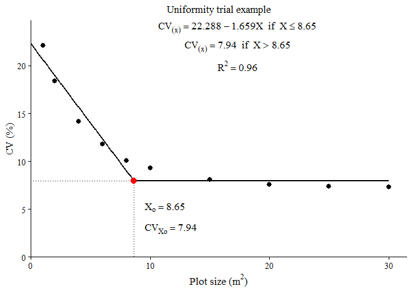

<!-- README.md is generated from README.Rmd. Please edit that file -->

# DimExp


<!-- badges: start -->

<!-- badges: end -->

DimExp provides tools for experimental design sizing in agricultural
research. It implements several methods for estimating the optimal plot
size from uniformity trial data, and for estimating the optimal number
of replications, with standardized diagnostic statistics and plots:

- `fit_lrp()`: optimal plot size via the Linear Response Plateau model
  (Paranaiba, Ferreira & Morais, 2009)
- `fit_qrp()`: optimal plot size via the Quadratic Response Plateau
  model (Peixoto, Faria & Morais, 2011)
- `fit_mcm()`: optimal plot size via the Modified Maximum Curvature
  method (Meier & Lessman, 1971)
- `calc_paranaiba()`: optimal plot size via the Paranaiba method
  (Paranaiba, Ferreira & Morais, 2009)
- `calc_replicates()`: optimal number of replications (Cargnelutti Filho
  et al., 2014)

The three plot-size functions share the same interface (numeric vectors
or a data frame with a trial column), return standardized fit
statistics, and produce publication-style plots that can be saved
directly to TIFF, PDF or PNG.

## Installation

You can install the development version of DimExp from
[GitHub](https://github.com/lpradebon/DimExp) with:

``` r
# install.packages("pak")
pak::pak("lpradebon/DimExp")
```

## Example

A basic uniformity-trial workflow: fit a Linear Response Plateau model
to coefficient of variation data across plot sizes, and inspect the
estimated optimal plot size. The breakpoint is found by a grid search,
so no starting values are needed.

``` r
library(DimExp)

# Example uniformity trial data: CV (%) decreasing with plot size
plot_size <- c(1, 2, 4, 6, 8, 10, 15, 20, 25, 30)
cv        <- c(22.1, 18.4, 14.2, 11.8, 10.1, 9.3, 8.1, 7.6, 7.4, 7.3)

fit <- fit_lrp(x = plot_size, cv = cv)
fit
#> Linear Response Plateau (LRP) fit
#> Method:                  segment 
#> Breakpoint (Xo):         8.648 
#> CV at breakpoint:        7.940 
#> R2: 0.963  RMSE: 0.935  AIC: 35.0  BIC: 36.3
```

The plot title (and other options) go on the `plot()` method, which
draws the fitted broken line, the breakpoint, and the plateau-model
annotations in the layout commonly used in plot-size articles:

``` r
plot(fit, title = "Uniformity trial example")
```



To export a figure, use `save = TRUE`; TIFF is written with LZW
compression, and vector formats are available for line art:

``` r
plot(fit, title = "Uniformity trial example",
     save = TRUE, file = "trial.tiff", format = "tiff", dpi = 300)
```

## Comparing plot-size methods

The Linear Response Plateau, Quadratic Response Plateau and Modified
Maximum Curvature methods are called the same way and often give
different optima. The optimal plot size typically increases in the order
MCM \< LRP \< QRP:

``` r
lrp <- fit_lrp(plot_size, cv)
qrp <- fit_qrp(plot_size, cv)
mcm <- fit_mcm(plot_size, cv)

data.frame(
  method = c("MCM", "LRP", "QRP"),
  Xo   = c(mcm$parameters["Breakpoint"],
           lrp$parameters["Breakpoint"],
           qrp$parameters["Breakpoint"]),
  CVxo = c(mcm$parameters["Breakpoint_Response"],
           lrp$parameters["Breakpoint_Response"],
           qrp$parameters["Breakpoint_Response"]),
  row.names = NULL
)
#>   method        Xo      CVxo
#> 1    MCM  4.142012 13.544829
#> 2    LRP  8.648000  7.940117
#> 3    QRP 12.311000  7.766405
```

### Several trials at once

Pass a data frame and the column names to fit one model per trial. The
result carries a per-trial summary table plus the individual fits (this
works for `fit_lrp()`, `fit_qrp()` and `fit_mcm()`):

``` r
trials <- rbind(
  data.frame(plot_size, cv, trial = "Trial A"),
  data.frame(plot_size, cv = cv + 1.5, trial = "Trial B")
)

res <- fit_lrp(trials, x = "plot_size", cv = "cv", trial = "trial")
#> Using x = 'plot_size', cv = 'cv', trial = 'trial' -> 2 trials.
res$summary
#>     trial       a       b breakpoint plateau     R2   RMSE    AIC    BIC
#> 1 Trial A 22.2884 -1.6591      8.648  7.9401 0.9628 0.9354 35.043 36.253
#> 2 Trial B 23.7884 -1.6591      8.648  9.4401 0.9628 0.9354 35.043 36.253
```

If the optimum is known to lie in a given region, restrict the
breakpoint search with `search_range`, for example
`fit_lrp(x = plot_size, cv = cv, search_range = c(5, 20))`.

## Number of replications

The CV at the optimal plot size feeds directly into the number of
replications needed to detect a given difference between treatment means
(as a percent of the mean), for CRD or RCBD designs:

``` r
cvxo <- unname(lrp$parameters["Breakpoint_Response"])

reps <- calc_replicates(
  treatments  = c(3, 5, 10, 20),
  cv_percent  = cvxo,
  lsd_percent = c(10, 20, 30),
  design      = "CRD"
)
reps
#> Optimal number of replications
#> Design: CRD  CV: 7.94%  alpha: 0.05 
#> Rows: 12  | Non-converged: 0 
#> 
#>  Treatments CV_percent LSD_percent Alpha Design r_continuous r_optimal df_error
#>           3   7.940117          10  0.05    CRD         8.01         9       24
#>           5   7.940117          10  0.05    CRD        10.17        11       50
#>          10   7.940117          10  0.05    CRD        13.10        14      130
#>          20   7.940117          10  0.05    CRD        16.12        17      320
#>           3   7.940117          20  0.05    CRD         2.98         3        6
#>           5   7.940117          20  0.05    CRD         3.26         4       15
#>  q_tukey converged
#>    3.532      TRUE
#>    4.002      TRUE
#>    4.553      TRUE
#>    5.054      TRUE
#>    4.339      TRUE
#>    4.367      TRUE
```

The output reports both `r_continuous` (the tabulated value) and
`r_optimal` (the practical integer, at least 2).

## Citation

If you use DimExp in your research, please cite the underlying methods
(see each function’s documentation for the corresponding reference) as
well as the package itself.
